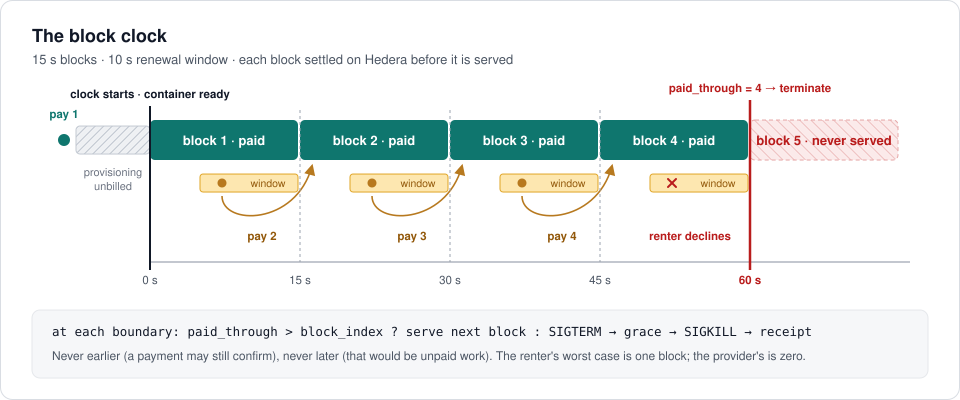
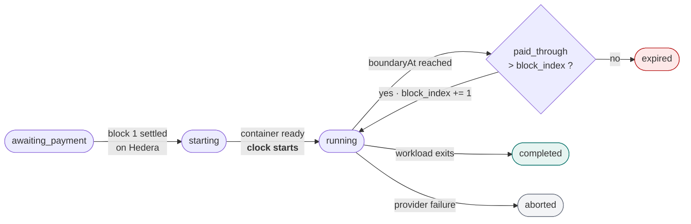
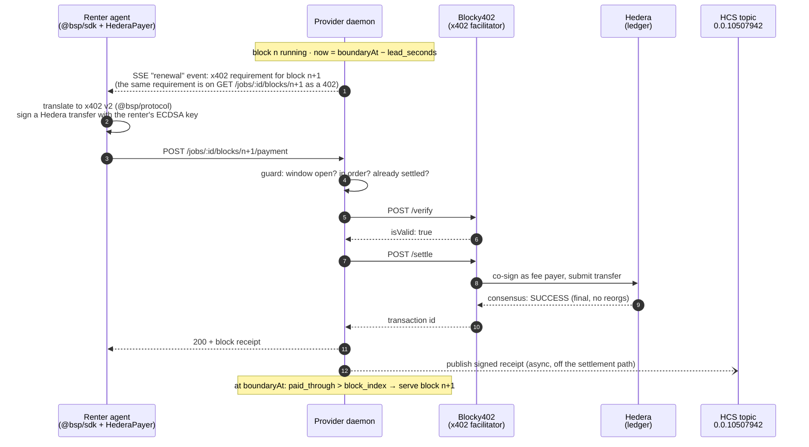
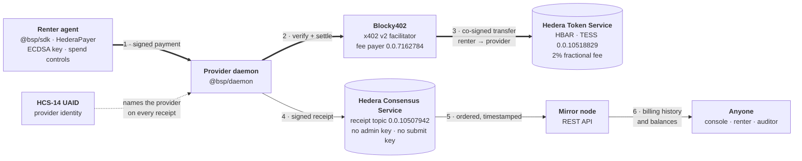
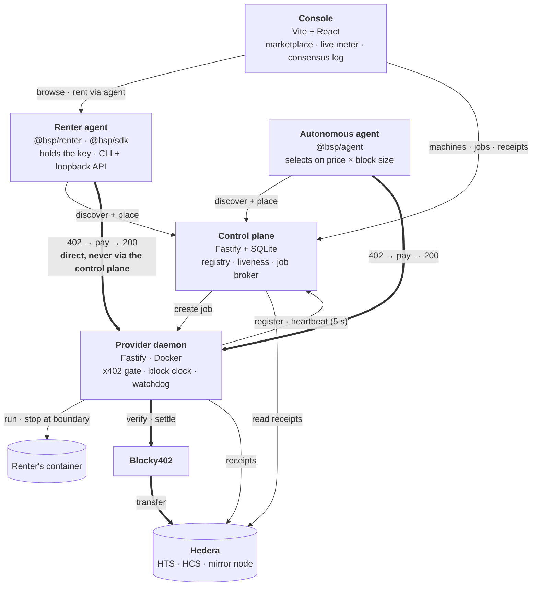

<div align="center">

# Tessera

### Rent compute by the block. Pay for each block before it runs.

**The Block Settlement Protocol (BSP)**: continuous, metered compute on x402, settled on **Hedera**.

[](https://hashscan.io/testnet/topic/0.0.10507942)
[](https://api.testnet.blocky402.com/supported)
[](https://hashscan.io/testnet/token/0.0.10518829)
[](https://hashscan.io/testnet/topic/0.0.10507942)
[](#5-hcs-14-agent-identity)
[](#testing)

*ETHOnline 2026 · Hedera track: AI & Agentic Payments*

</div>

---

A renter (a person or an AI agent) rents a container from a provider it has never met.
Time is cut into fixed **blocks**. Every block is **paid on Hedera before it is served**,
and the window to buy the next block opens while the current one is still running. If the
renter stops paying, the container stops at the next boundary. Not a second early, because a
payment may still land. Not a second late, because that would be unpaid work.

The provider never extends credit. The renter never pays a deposit. Nobody holds anyone's
money. Every block settles through the **Blocky402** x402 facilitator as a native Hedera
transfer, in HBAR or in our **HTS token**. Every receipt goes to an immutable **HCS topic**
that anyone can audit through a **mirror node**, and every provider carries an **HCS-14**
identity.

<p align="center">
  
</p>

## Contents

- [For reviewers: what is real](#for-reviewers-what-is-real)
- [The problem](#the-problem)
- [The Block Settlement Protocol](#the-block-settlement-protocol)
- [How Tessera uses Hedera](#how-tessera-uses-hedera)
- [A real job, end to end](#a-real-job-end-to-end)
- [Architecture](#architecture)
- [Run it](#run-it)
- [Testing](#testing)
- [Hedera track requirements](#hedera-track-requirements)
- [Honest limits and what's next](#honest-limits-and-whats-next)

---

## For reviewers: what is real

Nothing in the demo path is simulated. Every identifier below is live on Hedera testnet and
can be checked without trusting us.

| | Hedera testnet | Check it |
|---|---|---|
| **Receipt log** (HCS topic) | `0.0.10507942`: memo *"Tessera BSP v0.1 receipts (testnet)"*, no admin key, no submit key, 150+ receipts | [HashScan](https://hashscan.io/testnet/topic/0.0.10507942) · [mirror node](https://testnet.mirrornode.hedera.com/api/v1/topics/0.0.10507942/messages?order=desc&limit=25) |
| **Settlement token** (HTS) | `0.0.10518829`: **TESS**, *Tessera Compute Credit*, 2 decimals, 2% fractional custom fee | [HashScan](https://hashscan.io/testnet/token/0.0.10518829) · [mirror node](https://testnet.mirrornode.hedera.com/api/v1/tokens/0.0.10518829) |
| **Provider** account | `0.0.10507867` (ECDSA) | [HashScan](https://hashscan.io/testnet/account/0.0.10507867) |
| **Renter** account | `0.0.10401938` (ECDSA) | [HashScan](https://hashscan.io/testnet/account/0.0.10401938) |
| **Facilitator** | Blocky402, `https://api.testnet.blocky402.com`, x402 v2, fee payer `0.0.7162784` | [`/supported`](https://api.testnet.blocky402.com/supported) |
| **A settled TESS block** | block 10 of job `j_f75091e5`: renter −25, provider +25, `SUCCESS` | [`0.0.7162784@1789289513.241402920`](https://hashscan.io/testnet/transaction/0.0.7162784@1789289513.241402920) |
| **A settled HBAR block** | renter −100,000 tℏ, provider +100,000 tℏ, `SUCCESS` | [`0.0.7162784@1789277006.060479300`](https://hashscan.io/testnet/transaction/0.0.7162784@1789277006.060479300) |

**Four claims, and where each is proven:**

1. **Blocks really settle on Hedera, one per block, through Blocky402.** See [A real job, end to end](#a-real-job-end-to-end): ten TESS transfers, each linked to HashScan.
2. **The job really stops at the first unpaid boundary.** The terminal receipt, `reason: "unpaid_boundary"`, is on the HCS topic.
3. **The marketplace cannot take your money or stop your job.** [`tools/e2e/test/trust-boundary.e2e.test.ts`](tools/e2e/test/trust-boundary.e2e.test.ts) kills the control plane mid-job, and the job keeps running and billing.
4. **The protocol's timing is measured, not assumed.** The Blocky402 paid leg takes a median **3.2 s** (n=5), and SPEC §4.1's lead-time floor is derived from that. See [`docs/facilitator-contract.md`](docs/facilitator-contract.md).

---

## The problem

x402 is *request-shaped*: one request, one price, one payment, one response. That works
because the unit of value is discrete.

**Compute is not discrete.** A container consumes resources continuously while payments trail
behind it. x402 says nothing about the gap between *work happening* and *money arriving*, and
the two obvious ways to fill it both leave someone exposed:

| Model | How it works | Provider's worst case | Renter's worst case |
|---|---|---|---|
| **Credit** | serve now, bill later | the whole billing interval: an agent drains work and vanishes | none |
| **Escrow** | deposit up front, draw down | none | the whole lease, held in custody by someone else |
| **BSP** | prepay fixed blocks, renew inside a lookahead window | **zero**: the block being served is already settled | **one block** |

BSP takes the third path. Divide time into fixed blocks, require each block to be paid before
it begins, and open the window to buy block *n+1* while block *n* is still running. **The
lookahead absorbs settlement latency**, so service is continuous while neither side ever
extends credit.

This only works if settlement is fast, cheap, and final, which is why BSP is built on Hedera
(see [Why Hedera](#why-hedera-specifically)).

---

## The Block Settlement Protocol

The full specification is [**`SPEC.md`**](SPEC.md), written in RFC 2119 language. Here is
what matters.

### The four invariants

A conforming implementation MUST preserve all four. Everything else exists to serve them.

| | Invariant | What it means | How Tessera enforces it |
|---|---|---|---|
| **I1** | **No credit** | The block currently being served is always already settled. | The daemon starts or advances a job only after Blocky402's `/settle` returns a Hedera transaction. `verify` alone is not money. |
| **I2** | **Bounded renter exposure** | The renter's maximum loss is one block. | The renter pays for one block at a time. The SDK's budget cap and `maxBlocks` bound total spend. |
| **I3** | **Deterministic termination** | Service ends *at* a boundary, never between. No grace period. | A watchdog evaluates each boundary at or after `boundaryAt`, never before, within ~1 s. |
| **I4** | **No custody** | Payment moves renter → provider directly. | A single atomic Hedera transfer co-signed by the facilitator. No contract, treasury, or escrow ever holds funds. |

### Parameters: granularity is a market variable

Each provider sets these per listing. They are advertised at discovery and fixed for the life of a job.

| Parameter | Constraint | Tessera's testnet listing |
|---|---|---|
| `block_seconds` | 5 ≤ n ≤ 3600 | **15** |
| `lead_seconds` | ≥ 4, ≥ ⌈0.3 × block⌉, < block | **10** |
| `price_per_block` | > 0, smallest unit | **25** (0.25 TESS) |
| `asset` | `HBAR` or an HTS token id | **`0.0.10518829`** (TESS) |

The protocol deliberately does not fix block size. Shorter blocks mean less forfeited time and
finer control. Longer blocks mean fewer settlements and more tolerance for network trouble.
Renters shop on granularity alongside price, and the agent in [`packages/agent`](packages/agent)
does exactly that: a cheaper node with 60 s blocks can cost *more* for a 90 s job than a
pricier node with 15 s blocks.

**The lead-time floor is a measurement.** A renewal window must fit at least one facilitator
round trip, or every job would die at its first boundary. Against Blocky402 on Hedera testnet,
the full paid leg (`402 → sign → verify → settle → 200`) measured:

| Run | 1 | 2 | 3 | 4 | 5 | **Median** |
|---|---|---|---|---|---|---|
| ms | 3670 | 3294 | 3022 | 3090 | 3157 | **≈ 3.2 s** |

So a 4 s window admits exactly one attempt, and a 10 s window admits three. The registry
rejects anything under the floor, and the spec tells providers that retry headroom needs
`lead_seconds ≥ 8`.

### Job lifecycle



- **Provisioning is unbilled.** The clock starts when the container is *ready*. For a workload that serves a port, that means when the port accepts connections, not when Docker reports the process up. A renter who pays for 15 seconds gets 15 seconds.
- **Termination is ordered** (§5.5): `SIGTERM` → a 5 s non-billable grace period → `SIGKILL` → flush artifacts → terminal receipt. Artifacts from paid blocks are delivered even when a job ends `expired`.
- **Early exit forfeits the rest of the block** (§5.6). This is a minimum billing increment, as in any cloud.

### One renewal, step by step



If step 3 never happens (the renter declined, ran out of funds, or disappeared), there is **no
cancel message and no handshake**. At `boundaryAt` the watchdog sees `paid_through ≤ block_index`
and ends the job. Declining to pay *is* the kill switch.

### Wire format: stock x402 plus one namespaced extension

The provider's payment requirement is standard x402, and a client that ignores `blockMeta`
still settles correctly. Values from job `j_f75091e5` below (UAID shortened):

```json
{
  "x402Version": 1,
  "accepts": [{
    "scheme": "exact",
    "network": "hedera-testnet",
    "asset": "0.0.10518829",
    "payTo": "0.0.10507867",
    "maxAmountRequired": "25",
    "resource": "/jobs/j_f75091e5-9d45-4d06-b783-a38083870b15/blocks/10",
    "description": "Block 10 of 15s on uaid:aid:3d2hHT5p…;registry=tessera;nativeId=hedera:testnet:0.0.10507867",
    "facilitator": "https://api.testnet.blocky402.com"
  }],
  "blockMeta": {
    "protocol": "bsp/0.1",
    "jobId": "j_f75091e5-9d45-4d06-b783-a38083870b15",
    "blockIndex": 10,
    "blockSeconds": 15,
    "leadSeconds": 10,
    "clockStartedAt": "2026-09-13T08:49:51.099Z",
    "windowOpensAt":  "2026-09-13T08:51:56.099Z",
    "boundaryAt":     "2026-09-13T08:52:06.099Z"
  }
}
```

Every edge case has a defined answer, and each row below is a test:

| Situation | Response |
|---|---|
| Payment confirms inside the window, before the boundary | `200`, job advances |
| Payment attempt before the window opens | `425` with `windowOpensAt` |
| Payment for block *n+2* while *n+1* is unpaid | `409` with `expectedBlockIndex` |
| Payment after the boundary | `410`, job closed, **payment not captured** |
| Duplicate payment for a settled block | `200` with the *existing* receipt, **never charged twice** |
| Facilitator refuses (e.g. empty wallet) | `402` again, with the facilitator's reason attached |
| Event stream drops | Renewal continues on a timer derived from `clockStartedAt` |
| Provider crashes mid-job | Renter loses at most that block. On restart the job is marked `aborted` with a terminal receipt |

### Security model

- **Provider clock manipulation** is *detectable, not impossible*. Every receipt carries `clockStartedAt` and its own `boundaryAt`, so consecutive receipts must sit exactly `block_seconds` apart on a public log. A provider shortening blocks leaves the evidence on HCS.
- **Renewal denial** (withholding the next challenge) is capped at one block by I2, and it shows up in the receipt log.
- **Facilitator trust** is inherited from x402. Hedera's deterministic finality removes the reorg class of risk, and renters can verify settlement on a mirror node independently of the facilitator.
- **Workload isolation**: renter containers run with memory, CPU, PID and network limits, a read-only root filesystem, and `no-new-privileges`.
- **Out of scope** (SPEC §9): hardware attestation, reputation, workload correctness, refunds. BSP settles payment for continuous delivery. It does not claim more.

---

## How Tessera uses Hedera

Tessera is built on Hedera. Six Hedera capabilities each carry a piece of the protocol:



### 1. x402 payments on Hedera through Blocky402

Every block is an x402 `exact` payment on `hedera:testnet`, verified and settled through
[Blocky402](https://api.testnet.blocky402.com/supported).

- **Renter side:** [`packages/sdk/src/hedera-payer.ts`](packages/sdk/src/hedera-payer.ts) builds a signer with `@x402/hedera` from the renter's **ECDSA** key and creates the payment payload with `@x402/core`. It uses **spend controls**: a per-payment ceiling plus an allow-list of assets (`0.0.0` for HBAR and the TESS token id), so a misread requirement cannot sign away real money or be signed into a different token.
- **Provider side:** [`packages/daemon/src/payments/blocky402-client.ts`](packages/daemon/src/payments/blocky402-client.ts) calls `POST /verify` and then `POST /settle`. A verified payment is not money, so I1 is satisfied only once `settle` returns a Hedera transaction id.
- **One translation, both sides:** BSP's envelope is x402 v1-shaped, while Blocky402 speaks **v2** (`amount` for `maxAmountRequired`, `hedera:testnet` for `hedera-testnet`, `0.0.0` for `HBAR`, and a mandatory `extra.feePayer`). [`packages/protocol/src/x402v2.ts`](packages/protocol/src/x402v2.ts) is the *single* function both the renter and the provider use. The renter signs over exactly the requirements the provider verifies against, so a disagreement can never surface as an opaque signature failure.
- **Fee payer:** the facilitator co-signs as fee payer and submits the transaction. That is why every settlement's transaction id begins `0.0.7162784@…`, and why matching a payment to a payer by parsing the transaction id would be wrong.

### 2. Hedera Token Service: HBAR and the TESS settlement token

Blocks can be priced in **HBAR** or in any **HTS** fungible token. We minted one for the demo:

| | [`0.0.10518829`](https://hashscan.io/testnet/token/0.0.10518829) |
|---|---|
| Name / symbol | Tessera Compute Credit / **TESS** |
| Type | `FUNGIBLE_COMMON`, 2 decimals, supply 100,000.00 |
| Custom fee | **2% fractional fee**, denominated in TESS, fee-collector accounts exempt |
| Used for | the listing's `asset`, so each block costs 25 units (0.25 TESS) |

A settlement is a **native HTS transfer**, not a smart-contract call. The value moves renter →
provider in one atomic, co-signed transaction, so **I4 (no custody) is a property of the
ledger, not a promise of our code**. HBAR (`0.0.0`) stays supported, so anyone can try Tessera
without holding the token.

### 3. Hedera Consensus Service: a public, immutable billing log

Every settled block and every termination produces a receipt that is published to **HCS topic
[`0.0.10507942`](https://hashscan.io/testnet/topic/0.0.10507942)**
([`packages/hedera/src/topic.ts`](packages/hedera/src/topic.ts),
[`sink.ts`](packages/hedera/src/sink.ts)).

- **Immutable and open by construction.** The topic was created with **no admin key and no submit key**. Nobody, including us, can rewrite or delete the history.
- **Ordered and timestamped by consensus.** This is what makes provider clock manipulation *detectable*: receipts for one job must sit exactly `block_seconds` apart.
- **Validated before publishing.** A consensus message cannot be retracted, so a malformed receipt is refused while it is still a bug and not yet public evidence.
- **Never on the settlement path.** Consensus takes seconds, and a 10 s renewal window has none to spare. Receipts are queued and published in order by a drain loop, so an HCS hiccup can never make a paid block look unpaid.
- **Signed.** Each receipt carries a `providerSig` over canonical signing bytes that exclude the signatures themselves ([`packages/protocol/src/receipts.ts`](packages/protocol/src/receipts.ts)).
- **One shared topic, keyed by `jobId`.** A per-job topic would add a topic creation to the critical path. Readers skip anything on the topic that is not a well-formed BSP receipt, so junk from a stranger cannot break a renter's audit.

### 4. Mirror node: verification without asking the provider

A provider's account of what it billed is worth little. Consensus is worth a lot. Tessera reads
back through the **Hedera mirror node REST API**
([`packages/hedera/src/mirror.ts`](packages/hedera/src/mirror.ts)):

- The **console's "On the consensus log" panel** and the control plane's `/receipts` endpoint read receipts *from the mirror node*, never from our own database. Serving our own copy back would defeat the point.
- The renter CLI reads **HBAR and TESS balances** from the mirror node, to tell a renter how many blocks they can actually afford before they rent.
- An unreachable mirror node raises an error rather than returning an empty list, because "no receipts" and "couldn't check" mean opposite things to an auditor.

### 5. HCS-14 agent identity

Providers identify themselves with **HCS-14 Universal Agent IDs**, minted through the Hashgraph
Online standards SDK ([`packages/hedera/src/uaid.ts`](packages/hedera/src/uaid.ts)). The `aid`
method derives the identifier from the agent's metadata and the Hedera account it transacts as,
so the same provider always mints the same id and two providers cannot collide by accident:

```
uaid:aid:3d2hHT5p9bCreQLXjYeXZQBpkgdFodj4Ku9WziBKv12tMsoK7AncgoCnHz2FJj32tR;uid=0;registry=tessera;nativeId=hedera:testnet:0.0.10507867
```

The daemon mints it at startup. It goes into every payment description and every receipt it
publishes, and the console's consensus-log panel shows it in the *Signed by* column. Role is
part of the derivation, so one account acting as provider and as renter is two agents with two
ids.

### 6. Hiero SDK

[`@hiero-ledger/sdk`](https://github.com/hiero-ledger/hiero-sdk-js) handles topic creation,
message submission and key handling ([`packages/hedera/src/client.ts`](packages/hedera/src/client.ts)).
Writes and reads are always built for the **same network**. Mainnet receipts read off the
testnet mirror would come back as an empty history, which looks exactly like a provider that
never published anything.

### Why Hedera, specifically

BSP makes demands on a ledger that most chains cannot meet at a 15-second cadence:

| BSP needs | Hedera provides | Consequence |
|---|---|---|
| A payment to be *final* before the boundary | **Deterministic finality**, no reorgs | A settled block can be served immediately. There is no "wait N confirmations" eating the renewal window. |
| A settlement that fits inside a window | Consensus in seconds: the paid leg measured a median **3.2 s** | A 10 s window fits three attempts. |
| Per-block fees far below the block price | **Low, fixed, USD-denominated fees** | Settling every 15 seconds is economically sane, and the facilitator pays the network fee. |
| Direct payment without a contract | **Native HTS transfers** | I4 holds by construction. No escrow contract to audit or trust. |
| A tamper-evident, public, ordered log | **HCS** with a keyless topic | Billing history anyone can audit, for a fraction of a cent per receipt. |
| Portable agent identity | **HCS-14** | Receipts name agents with ids that other tooling can read. |

### What we learned about Blocky402

[`docs/facilitator-contract.md`](docs/facilitator-contract.md) is written from **observed
behaviour** against the live facilitator, not from assumptions. These findings are worth
knowing before building on it:

- **It is not idempotent.** A second `settle` of the same payload fails with `DUPLICATE_TRANSACTION` and an *empty* transaction id. SPEC §6.3's "a duplicate payment returns the existing receipt" is therefore the daemon's guarantee to keep. It does, with a `(jobId, blockIndex)` guard that runs before the facilitator is ever called.
- **Failures arrive as another `402` with an empty body.** The reason is in the `error` field of the `PAYMENT-REQUIRED` header.
- **A `payTo` equal to the payer nets to zero** and is rejected as `invalid_exact_hedera_payload_amount_mismatch`, with no hint that self-payment is the cause.
- **HBAR is not a "default asset"** to x402's spend controls and must be explicitly allowed. Also, `new x402Client({...})` takes a requirements *selector*, not a config object: spend controls passed there are silently ignored.
- **Separate verify-then-settle costs ~4.8 s**, which is more than the protocol's 4 s floor. That is why real listings use a 10 s window.

---

## A real job, end to end

Job **`j_f75091e5`** on Hedera testnet: the renter rents a node to host a website (an ordinary
container image, [`examples/demo-site`](examples/demo-site)), with **15 s blocks**, a **10 s
window**, and **25 units (0.25 TESS) per block**. The renter's wallet held exactly ten blocks.

**Every row is a real Hedera transaction and a real HCS message.** The `boundaryAt` column comes
from the receipts on the consensus log: exactly 15 s apart, as SPEC §6.2 requires.

| Block | Settlement (HashScan) | Receipt `boundaryAt` (UTC) | HCS seq |
|---:|---|---|---:|
| 1 | [`0.0.7162784@1789289380.761385075`](https://hashscan.io/testnet/transaction/0.0.7162784@1789289380.761385075) | 08:50:06.099 | 140 |
| 2 | [`0.0.7162784@1789289392.265103338`](https://hashscan.io/testnet/transaction/0.0.7162784@1789289392.265103338) | 08:50:21.099 | 141 |
| 3 | [`0.0.7162784@1789289403.878625759`](https://hashscan.io/testnet/transaction/0.0.7162784@1789289403.878625759) | 08:50:36.099 | 142 |
| 4 | [`0.0.7162784@1789289420.046848375`](https://hashscan.io/testnet/transaction/0.0.7162784@1789289420.046848375) | 08:50:51.099 | 143 |
| 5 | [`0.0.7162784@1789289434.371786369`](https://hashscan.io/testnet/transaction/0.0.7162784@1789289434.371786369) | 08:51:06.099 | 144 |
| 6 | [`0.0.7162784@1789289448.556640925`](https://hashscan.io/testnet/transaction/0.0.7162784@1789289448.556640925) | 08:51:21.099 | 145 |
| 7 | [`0.0.7162784@1789289465.144749596`](https://hashscan.io/testnet/transaction/0.0.7162784@1789289465.144749596) | 08:51:36.099 | 146 |
| 8 | [`0.0.7162784@1789289478.860471059`](https://hashscan.io/testnet/transaction/0.0.7162784@1789289478.860471059) | 08:51:51.099 | 147 |
| 9 | [`0.0.7162784@1789289496.368281381`](https://hashscan.io/testnet/transaction/0.0.7162784@1789289496.368281381) | 08:52:06.099 | 148 |
| 10 | [`0.0.7162784@1789289513.241402920`](https://hashscan.io/testnet/transaction/0.0.7162784@1789289513.241402920) | 08:52:21.099 | 149 |
| 11 | **refused**: the wallet is empty | none | none |
| end | `terminated`, `reason: "unpaid_boundary"`, `finalBlockIndex: 10` | none | 150 |

What happened, in order:

1. **Discovery.** `tessera machines` reads the registry and shows the renter the price, block size, window, hardware, and how many blocks their TESS balance buys (read from the mirror node).
2. **Placement.** The control plane asks the node to create the job and hands back the node's `402` untouched. After this, the control plane is out of the loop.
3. **Block 1 is paid before the image is even pulled.** It settled at consensus time `08:49:49.83`. The container became ready and the **clock started at `08:49:51.099`**, so provisioning was not billed.
4. **Renewals.** Ten seconds before each boundary the node opens the window, and the renter's agent pays for the next block while the current one is still running. Block 10's payment reached consensus at `08:51:59.98`, **6.1 s before** its deadline.
5. **The money runs out.** The wallet was topped up to exactly 250 units before the job, and ten transfers of −25 took it to zero (all visible on the mirror node). The facilitator refuses block 11. The SDK reports the reason once and keeps retrying until the window closes.
6. **At the boundary, `08:52:21.099`, the website stops.** The watchdog sends `SIGTERM`, waits the grace period, sends `SIGKILL`, and publishes the terminal receipt.
7. **Anyone can audit it.** Here is block 10's receipt as it sits on HCS, fetched from the [mirror node](https://testnet.mirrornode.hedera.com/api/v1/topics/0.0.10507942/messages/149):

```json
{
  "v": 1,
  "protocol": "bsp/0.1",
  "type": "block_receipt",
  "jobId": "j_f75091e5-9d45-4d06-b783-a38083870b15",
  "blockIndex": 10,
  "amount": "25",
  "asset": "0.0.10518829",
  "txId": "0.0.7162784@1789289513.241402920",
  "clockStartedAt": "2026-09-13T08:49:51.099Z",
  "boundaryAt": "2026-09-13T08:52:21.099Z",
  "providerUaid": "uaid:aid:3d2hHT5p9bCreQLXjYeXZQBpkgdFodj4Ku9WziBKv12tMsoK7AncgoCnHz2FJj32tR;uid=0;registry=tessera;nativeId=hedera:testnet:0.0.10507867",
  "renterUaid": "uaid:testnet:0.0.10401938",
  "providerSig": "pK6gPGUZTE4kDTu5EZHXIYGaDf2PrCoIAJ0EWil7feKnQsD7sHUGICQjffQpRIy57O4lMfft6kzHbQaJJMDDAg=="
}
```

---

## Architecture



### The trust boundary

**The control plane is not in the payment path.** It handles discovery and placement, then gets
out of the way. The renter pays the provider directly and watches the provider's own event
stream. If the marketplace operator disappears mid-job, the job keeps running and keeps billing.

That is the difference between *a centralised marketplace with a crypto button* and *a
marketplace whose operator cannot take your money or stop your job*. The claim is also a test:
[`trust-boundary.e2e.test.ts`](tools/e2e/test/trust-boundary.e2e.test.ts) kills the control
plane after block 2, blocks 3 and 4 still settle, and the job still terminates deterministically
at its boundary.

Similarly, **the browser never holds a key.** The console drives the renter's local agent, and
the agent is the only thing that signs. A browser wallet could replace it without changing
anything else.

### Packages

| Package | Responsibility |
|---|---|
| [`packages/protocol`](packages/protocol) | Wire types, receipt schema and canonical signing bytes, §4.1 listing validation, the x402 v1 → v2 translation, fixed benchmark |
| [`packages/core`](packages/core) | The `BlockClock` reducer and job state machine: pure, with no timers and no I/O |
| [`packages/hedera`](packages/hedera) | HCS publish/read, receipt signing, mirror-node reader, HCS-14 UAIDs, Hiero SDK adapter |
| [`packages/daemon`](packages/daemon) | Provider node: x402 gate, Blocky402 client, Docker executor, watchdog, receipts, SSE, crash recovery |
| [`packages/control-plane`](packages/control-plane) | Registry with liveness, §4.1 rejection, job broker that never proxies payment, receipt read-through |
| [`packages/sdk`](packages/sdk) | Renter client: `Marketplace`, `Job`, the renewal loop, budget cap, backoff, stream reconnect, timer fallback, `HederaPayer` |
| [`packages/renter`](packages/renter) | `tessera` (renter CLI), `tessera-node` (provider CLI), and the renter agent the console talks to |
| [`packages/agent`](packages/agent) | Unattended agent: quotes every machine for a workload, rents the cheapest overall, reports cost per unit of work |
| [`packages/console`](packages/console) | The web console: marketplace, per-renter dashboard, the meter, the consensus-log panel |
| [`tools/e2e`](tools/e2e) | Full-stack harness, including the trust-boundary test, plus the testnet demo scripts |
| [`tools/fake-facilitator`](tools/fake-facilitator) | Deterministic verify/settle for offline development and CI |
| [`tools/phase0-spike`](tools/phase0-spike) | The first real Blocky402 payment and the paid-leg timing measurement |

The dependency rule: `core` depends only on `protocol`, and nothing depends on `daemon`. That
keeps the block clock testable with no network and no Docker.

---

## Run it

Requires **Node ≥ 20**, **pnpm 10**, and **Docker**.

```sh
git clone https://github.com/princepanwar2k3/Tessera.git && cd Tessera
pnpm install && pnpm -r build
```

### Offline, in about a minute (no Hedera account needed)

Uses the mock facilitator, and every step below has been run as written:

```sh
# 1. the marketplace (registry + broker) on :8090
node packages/control-plane/dist/index.js &

# 2. a provider node on :8080, selling 15 s blocks with a 10 s window
PORT=8080 PROVIDER_ID=node-a DEFAULT_BLOCK_SECONDS=15 DEFAULT_LEAD_SECONDS=10 \
  CONTROL_PLANE_URL=http://127.0.0.1:8090 node packages/daemon/dist/index.js &

# 3. an agent discovers it, rents it unattended, and reports what the work cost
pnpm -F @bsp/agent demo -- --seconds 40 --budget 4500 --units 3 --unit-label frame
```

```
Workload: ~40s, budget 4500
node-a: 15s blocks @ 1500 → 3 blocks = 4500 (5s forfeited)
Chose node-a: 4500 total.
  block 2 settled  …
  block 3 settled  …
  declining block 4: max_blocks_reached
Ended: unpaid_boundary after 3 blocks, spent 4500 (estimated 4500 over 3).
Cost per frame: 1500.00
```

> If containers exit with `exec /bin/sh: operation not permitted`, your kernel refuses to exec
> under Docker's `no-new-privileges`. Set `NO_NEW_PRIVILEGES=false`. Every other isolation
> control stays on.

### On Hedera testnet, for real

You need **two ECDSA testnet accounts** from [portal.hedera.com](https://portal.hedera.com),
one for the provider and one for the renter (a payment to yourself nets to zero and is
rejected), funded at [faucet.hedera.com](https://faucet.hedera.com). Copy
[`.env.example`](.env.example) to `.env` and fill it in. To settle in a token, associate both
accounts with it and set `HTS_SETTLEMENT_TOKEN_ID`.

```sh
docker build -t tessera-demo-site:latest examples/demo-site
set -a; . ./.env; set +a
```

**1. The marketplace**, reading receipts back from your HCS topic:

```sh
CONTROL_PLANE_PORT=8090 HCS_RECEIPT_TOPIC_ID=<topic> node packages/control-plane/dist/index.js
```

**2. A provider lists a machine.** It settles through Blocky402, publishes receipts to HCS,
and mints its HCS-14 identity:

```sh
PAY_TO=<provider account> NETWORK=hedera-testnet \
FACILITATOR_MODE=blocky402 FACILITATOR_FEE_PAYER=0.0.7162784 \
RECEIPT_SINK=local+hcs HCS_RECEIPT_TOPIC_ID=<topic> HEDERA_NETWORK=testnet \
CONTROL_PLANE_URL=http://127.0.0.1:8090 \
  node packages/renter/dist/provider-cli.js list \
    --name node-a --block-seconds 15 --lead 10 --price 25 --asset TESS
```

```
  Listing node-a
    block size      15s   what a renter buys at a time
    renewal window  10s   how long they have to buy the next one
    price           25 TESS  per block
```

`tessera-node` checks the §4.1 floor before anything starts, so a window no renter could pay
inside fails on the provider's own machine.

**3. A renter shops, then rents a website:**

```sh
node --env-file=.env packages/renter/dist/cli.js machines
node --env-file=.env packages/renter/dist/cli.js rent \
  --machine node-a --image tessera-demo-site:latest --blocks 20
```

The renter CLI quotes the spend cap against the wallet *before* paying anything. It prints the
live site URL and a console link, then streams every window, settlement and transaction id
until the job ends.

**4. The console:**

```sh
VITE_REGISTRY_URL=http://127.0.0.1:8090 VITE_HCS_TOPIC_ID=<topic> VITE_HEDERA_NETWORK=testnet \
VITE_SETTLEMENT_TOKEN_ID=<token> VITE_SETTLEMENT_TOKEN_SYMBOL=TESS \
  pnpm -F @bsp/console exec vite --port 5180 --host 127.0.0.1 --strictPort
```

To rent from the browser instead of the terminal, start the renter agent. It holds the key, so
the page never does:

```sh
RENTER_PORT=8091 REGISTRY_URL=http://127.0.0.1:8090 FACILITATOR_FEE_PAYER=0.0.7162784 \
  node packages/renter/dist/index.js
```

Scripted alternatives are [`tools/e2e/scripts/testnet-demo.mjs`](tools/e2e/scripts/testnet-demo.mjs)
(three HBAR blocks) and [`hosted-site-demo.mjs`](tools/e2e/scripts/hosted-site-demo.mjs) (host
a site, stop paying, watch it go down). `bash scripts/reset.sh` stops everything and clears
local state between runs.

### Configuration that decides how real it is

| Variable | Values |
|---|---|
| `FACILITATOR_MODE` | `mock` (default, no credentials, used by CI) · `blocky402` (requires `FACILITATOR_FEE_PAYER`) |
| `RECEIPT_SINK` | `local` (default) · `hcs` · `local+hcs`. HCS modes require a topic and operator keys, and **the daemon refuses to boot without them** rather than leave the audit log quietly empty |
| `ASSET` | `HBAR` or an HTS token id |
| `DEFAULT_BLOCK_SECONDS` / `DEFAULT_LEAD_SECONDS` | validated against SPEC §4.1 at startup |

### Using the SDK

```ts
import { Marketplace, HederaPayer } from "@bsp/sdk";

const marketplace = new Marketplace({
  registryUrl: "http://127.0.0.1:8090",
  renterUaid: `uaid:testnet:${accountId}`,
  payer: new HederaPayer({
    accountId,
    privateKey,                         // ECDSA
    feePayer: "0.0.7162784",            // Blocky402's co-signer
    allowedAssets: ["0.0.0", "0.0.10518829"],
    maxAmountPerPayment: "10000000",
  }),
});

const job = await marketplace.rent({
  machine: "node-a",
  image: "tessera-demo-site:latest",
  exposedPort: 8080,
  budget: "250",
  maxBlocks: 10,
});

job.on("block",   (b) => console.log(`block ${b.index} settled`, b.txId));
job.on("renewal", (w) => console.log(`window for block ${w.index}: ${w.msLeft} ms to pay`));

const result = await job.result();      // resolves at the terminal receipt
```

The kill switch is `job.stopRenewing()`. It sends nothing to the provider; the job simply ends
at the next boundary.

---

## Testing

**356 tests across 11 packages, all passing:** `pnpm -r build && pnpm -r test`.

| Package | Tests | Package | Tests |
|---|---:|---|---:|
| `daemon` | 118 | `console` | 18 |
| `sdk` | 52 | `core` | 13 |
| `protocol` | 41 | `agent` | 12 |
| `hedera` | 41 | `renter` | 11 |
| `control-plane` | 31 | `e2e` | 10 |
| `fake-facilitator` | 9 | | |

- `core` and `protocol` were built **test-first**. Every SPEC §7 row runs against a fake clock, with no timers and no waiting.
- The **payment gate's decision table** (`402`/`409`/`410`/`425`/duplicate-`200`) is tested exhaustively, as is the §5.5 termination order and SQLite crash recovery.
- The **Blocky402 client** is pinned to the facilitator's observed responses, including its non-idempotent duplicate settle.
- The **HCS path** is tested against a fake consensus client: a six-block job's receipts on a shared topic, junk messages ignored, publish failures never failing settlement.
- **`tools/e2e`** runs the real control plane, daemon, SDK and agent together, including the trust-boundary test.

---

## Hedera track requirements

| Requirement | Where it is satisfied | Status |
|---|---|---|
| x402-gated service settled through **Blocky402** | [`blocky402-client.ts`](packages/daemon/src/payments/blocky402-client.ts), [`blocks.route.ts`](packages/daemon/src/routes/blocks.route.ts) | ✅ live on testnet |
| An **agent** consuming it, with real paid requests end to end | [`packages/agent`](packages/agent), [`packages/renter`](packages/renter), [`hedera-payer.ts`](packages/sdk/src/hedera-payer.ts) | ✅ real settlements |
| **Compute metering** rather than flat per-request pricing | [`packages/core/src/clock.ts`](packages/core/src/clock.ts), [`scheduler.ts`](packages/daemon/src/jobs/scheduler.ts) | ✅ |
| **Recurring / streamed payments** | the block renewal loop, [`packages/sdk/src/job.ts`](packages/sdk/src/job.ts) | ✅ one payment per block |
| **HTS token** with a **custom fee schedule** | TESS [`0.0.10518829`](https://hashscan.io/testnet/token/0.0.10518829), 2% fractional fee | ✅ live on testnet |
| **Verifiable audit trail on HCS** | topic [`0.0.10507942`](https://hashscan.io/testnet/topic/0.0.10507942), [`packages/hedera`](packages/hedera) | ✅ live on testnet |
| **On-chain agent identity (HCS-14)** | [`uaid.ts`](packages/hedera/src/uaid.ts), on every provider receipt | ✅ |
| **Agent discovery** | [`packages/control-plane`](packages/control-plane): `GET /machines` | ✅ |
| Public repo with setup, architecture and payment flow | this file, [`SPEC.md`](SPEC.md), [`docs/facilitator-contract.md`](docs/facilitator-contract.md) | ✅ |
| Multi-agent negotiation | out of scope by SPEC §9 (price discovery and negotiation) | deliberately skipped |

---

## Honest limits and what's next

BSP settles payment for continuous delivery. It does **not** establish that a provider's
advertised hardware is truthful or that the delivered work is correct. Both need separate
mechanisms, and SPEC §9 says so rather than implying otherwise.

What is not done yet:

- **No public deployment.** The stack runs locally against the real Hedera network. It is one provider node, though the same code runs any number.
- **Renter identity is an account-scoped string** (`uaid:testnet:<account>`), not an HCS-14 UAID yet. `renterUaid()` exists in `@bsp/hedera`, but the SDK does not use it.
- **Receipts carry only the provider's signature.** The spec's `renterSig` (evidence of *agreement*, not just a claim) is defined and verifiable in `@bsp/hedera`, but the SDK does not co-sign yet. Receipt signatures are also not yet bound to the provider's Hedera account key.
- **Hardware attestation** is a self-reported benchmark (`selfReported: true`).
- In the recorded runs, the renter's account is also TESS's treasury and fee collector, so it is fee-exempt and the demo transfers show no fee deduction. The 2% fee applies to transfers between non-collector accounts.

What's next:

- **Two nodes with different block sizes**, so granularity-as-a-market-variable is visible live rather than only in the agent's selection tests.
- **Renter co-signed receipts and renter HCS-14 identities**, turning each receipt from evidence of a claim into evidence of agreement.
- **Mainnet**: the network is a configuration value throughout (`hedera:mainnet`, the mainnet mirror node).
- **Workload verification and reputation**, built on the public receipt history HCS already provides.

---

<div align="center">

**[SPEC.md](SPEC.md)** · **[Facilitator contract](docs/facilitator-contract.md)** · **[Receipt log on HashScan](https://hashscan.io/testnet/topic/0.0.10507942)** · **[TESS token](https://hashscan.io/testnet/token/0.0.10518829)**

Built for ETHOnline 2026 on Hedera.

</div>
