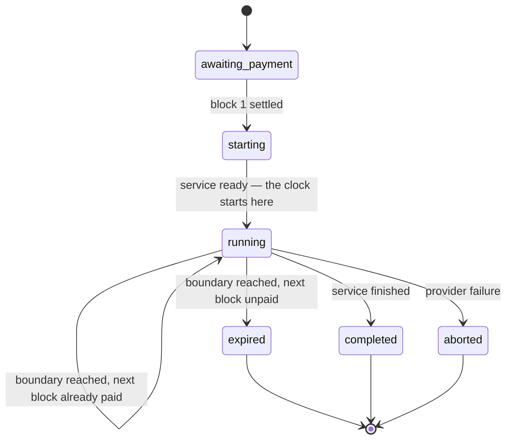
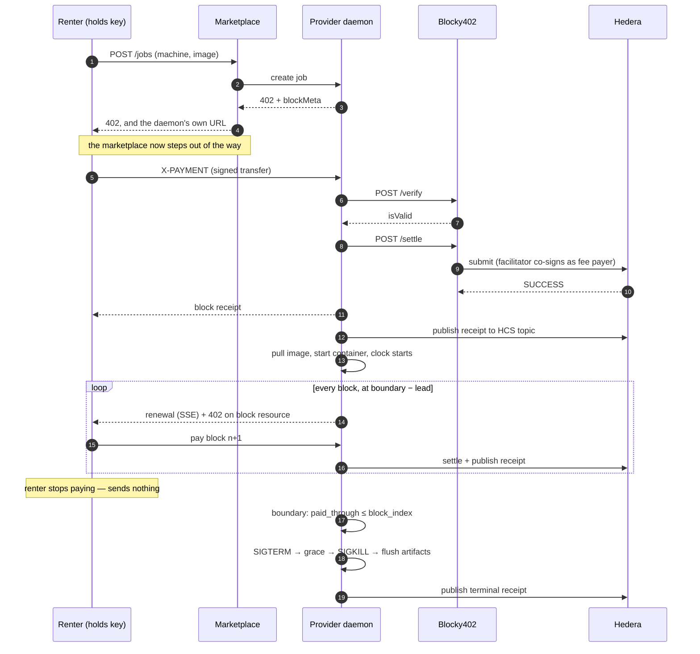
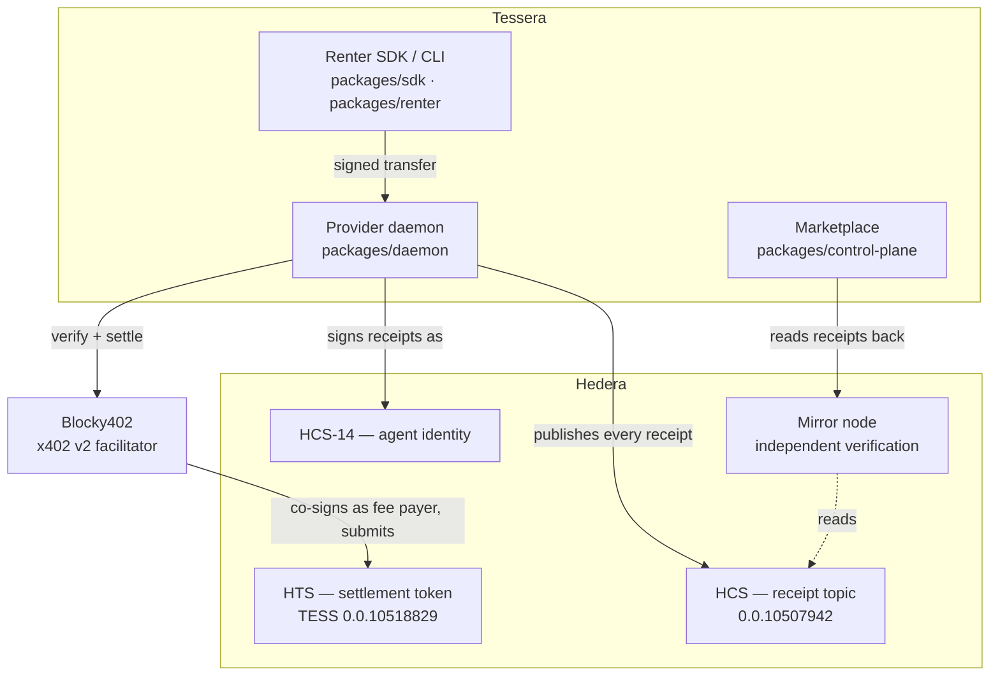
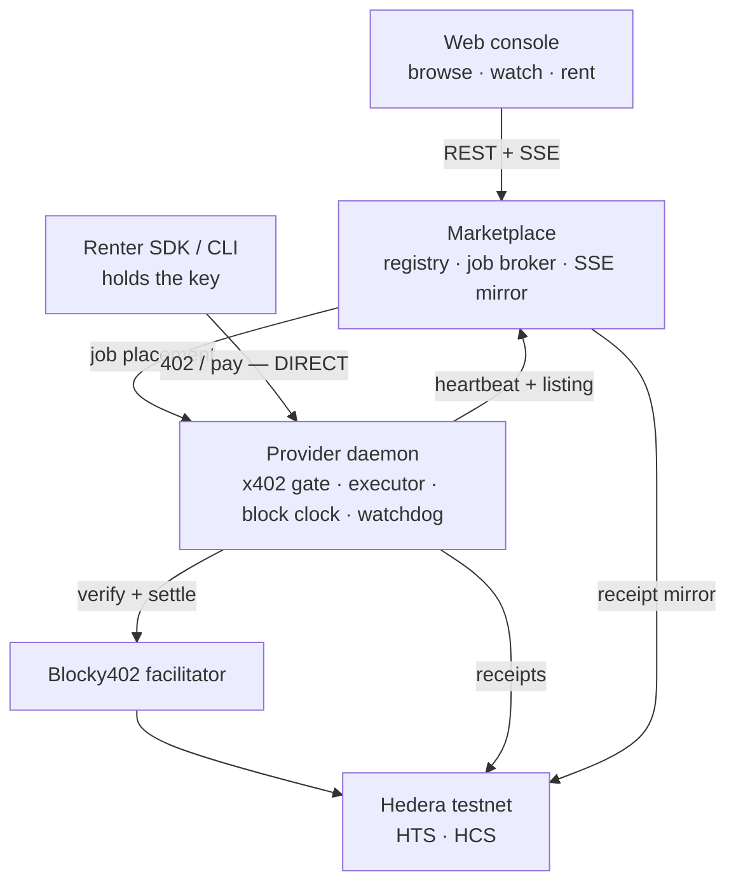

# Tessera

**Rent a computer by the block. Pay for each block before it runs.**

Block Settlement Protocol (BSP) v0.1 — prepaid block settlement for continuous
compute, built on [x402](https://x402.org) and settled on Hedera.

*ETHOnline 2026 · Hedera AI & Agentic Payments track*

Settlement is real. Every block below was paid on **Hedera testnet** through the
**Blocky402** x402 facilitator, in an **HTS token** we minted, with every receipt
published to **Hedera Consensus Service** and signed by an **HCS-14** identity.

---

## See it settle

| | |
|---|---|
| **Receipt topic (HCS)** | [`0.0.10507942`](https://hashscan.io/testnet/topic/0.0.10507942) — the public billing history |
| **Settlement token (HTS)** | [`0.0.10518829`](https://hashscan.io/testnet/token/0.0.10518829) — TESS, 2 decimals |
| **Provider account** | [`0.0.10507867`](https://hashscan.io/testnet/account/0.0.10507867) |
| **Renter account** | [`0.0.10401938`](https://hashscan.io/testnet/account/0.0.10401938) |
| **Facilitator** | `https://api.testnet.blocky402.com` (x402 v2, `hedera:testnet`) |
| **Example settlement** | [`0.0.7162784@1789293524.014699421`](https://hashscan.io/testnet/transaction/0.0.7162784@1789293524.014699421) |

A real run, from the renter's terminal — a wallet with three blocks in it
against a ten-block budget:

```
  machine   node-a  (15s blocks)
  image     tessera-demo-site:latest
  buying    10 blocks = 150s of uptime
  spend cap 250 TESS
  you hold  75 TESS — enough for 3 blocks

  The cap is 10 blocks but you can only pay for 3.
  The site will go down when the money runs out, at block 3.

  Your site is live:  http://127.0.0.1:32952
  Watch it settle:    http://127.0.0.1:5175/#/job/j_27df8dc6-7491-4eeb-97c4-ba288ccc8959

09:58:35  window  block 2 — paying
09:58:41  paid    block 2  0.0.7162784@1789293508.509432405
09:58:50  window  block 3 — paying
09:58:54  paid    block 3  0.0.7162784@1789293524.014699421
09:59:05  window  block 4 — paying
09:59:06  error   block 4 refused: preflight_failed (not enough of the settlement asset)

  ended       unpaid_boundary
  blocks paid 3
  spent       75 TESS
  http://127.0.0.1:32952 is no longer served
```

The website existed for exactly as long as it was paid for, and stopped at a
block boundary — not a second before, because a payment could still have landed,
and not a second after, because that would be unpaid work.

---

## The problem

x402 is request-shaped: one request, one price, one payment, both sides stateless
afterward. That works because the unit of value is discrete.

A container has no such unit. It consumes resources *continuously* while payments
trail behind, and the two obvious answers are both bad.

```
SERVE ON CREDIT                          TAKE A DEPOSIT
┌──────────────────────────┐             ┌──────────────────────────┐
│ work ████████████████    │             │ ▓▓▓▓ escrow held ▓▓▓▓▓▓▓ │
│ pay          ▲           │             │ work ████████████████    │
│              └ maybe     │             │ refund?          ▲       │
└──────────────────────────┘             └──────────────────────────┘
  Provider is exposed for the               Renter is exposed for the
  whole reconciliation window.              whole lease. This is the
  An agent can drain and vanish.            deposit model x402 replaced.
```

**Somebody is always exposed.** BSP takes a third path.

---

## Block Settlement Protocol

Divide time into fixed **blocks**. Require each block to be paid *before* it
begins. Open the window to buy block *n+1* while block *n* is still running.

That lookahead is the whole trick: it absorbs the few seconds a payment takes to
settle, so service is continuous while **neither side ever extends credit**.

```
 clock starts                                                        boundary
 (container ready)                                                       │
      │                     block n  (already paid)                      │
      ├─────────────────────────────────────────┬──────────────────────► │
      0s                                       5s                      15s
                                                │   renewal window       │
                                                ├──────────────────────► │
                                                │                        │
                                   provider offers block n+1      provider evaluates:
                                   (402 + SSE `renewal`)          paid_through > block_index ?
                                                                    yes → serve block n+1
                                                                    no  → terminate
```

Provisioning — image pull, container create, cold start — happens **before** the
clock starts and is **not billed**. A renter who pays for 15 seconds gets 15
seconds of usable service.

### The four invariants

Everything else is in service of these. [`SPEC.md §3`](./SPEC.md)

| | |
|---|---|
| **I1 — No credit** | At every instant, the block being served is already settled. The provider never performs unpaid work. |
| **I2 — Bounded exposure** | The renter's maximum loss from provider failure is **one block**. |
| **I3 — Deterministic termination** | Service ends *at* a boundary, never between. No grace period — the renewal window serves that function. |
| **I4 — No custody** | Payment moves renter → provider directly. No escrow, no treasury, no third party ever holds renter funds. |

### Job lifecycle



### What happens on the wire



### Required behaviours

Every row is a passing test in `packages/core` and `packages/daemon`.

| Case | Behaviour |
|---|---|
| Payment confirms inside the window, before the boundary | Accepted, job advances |
| Payment confirms after the boundary | `410`, job closed, payment not captured |
| Payment for block `n+2` while `n+1` unpaid | `409` with `expectedBlockIndex` |
| Duplicate payment for a settled block | `200` with the existing receipt, never double-charged |
| Payment attempt before the window opens | `425` with `windowOpensAt` |
| Provisioning exceeds one block | Provider absorbs it; block 1 is still a full block |
| Service exits early | Remainder of the block forfeited, not refunded |
| Renter disappears | Job ends at the next boundary. No cleanup handshake |
| Facilitator times out mid-window | Renter retries with backoff inside the window |
| Event stream drops | Renewal continues on a timer derived from `clockStartedAt` |

---

## Built on Hedera

Five Hedera services, each doing real work rather than appearing for the sake of
a checklist.



### 1. HTS — the settlement token

Blocks are priced and paid in **TESS**
([`0.0.10518829`](https://hashscan.io/testnet/token/0.0.10518829)), a fungible
token with 2 decimals, not in HBAR. Every block payment is a real token transfer:

```
0.0.10518829   0.0.10401938  -25     ← renter
0.0.10518829   0.0.10507867  +25     ← provider
```

The token also carries a **2% fractional custom fee**, visible on HashScan.
Honest caveat: in this demo the payer *is* the fee collector, and collectors are
exempt, so the fee is configured but **not assessed** in these runs. HBAR pricing
works too — set `ASSET=HBAR` and nothing else changes.

`packages/protocol/src/x402v2.ts` · `packages/hedera`

### 2. HCS — the public billing history

Every settled block and every termination is published to one shared consensus
topic, [`0.0.10507942`](https://hashscan.io/testnet/topic/0.0.10507942). A real
receipt from that topic:

```json
{
  "v": 1,
  "protocol": "bsp/0.1",
  "type": "block_receipt",
  "jobId": "j_38cda8d6-5d55-4e42-ba6d-45721ace371e",
  "blockIndex": 3,
  "providerUaid": "uaid:aid:3d2hHT5p9bCreQLXjYeXZQBpkgdFodj4Ku9WziBKv12tMsoK7AncgoCnHz2FJj32tR;uid=0;registry=tessera;nativeId=hedera:testnet:0.0.10507867",
  "renterUaid": "uaid:testnet:0.0.10401938",
  "asset": "0.0.10518829",
  "amount": "25",
  "txId": "0.0.7162784@1789293332.867674392",
  "clockStartedAt": "2026-09-13T09:55:18.103Z",
  "boundaryAt": "2026-09-13T09:56:03.103Z",
  "providerSig": "Ae4AGoo3MCy8zUSKsct14DLNdBAUDa0HTccZWDdvuErdJ3RFCmbxeJri4IW+nVnsk0gOxIswE0+yExWzUkl/Aw=="
}
```

This is what makes the protocol's security argument work. A provider is
authoritative on timing and *could* shorten blocks to bill more often — but
`clockStartedAt` and `boundaryAt` are on a public log, so systematic shortening
is **detectable across the receipt history** rather than merely deniable.
Cheating becomes auditable, not impossible — and the spec says exactly that
rather than pretending otherwise.

`packages/hedera/src/topic.ts` · `packages/hedera/src/sink.ts`

### 3. HCS-14 — on-chain agent identity

Receipts are signed by a real HCS-14 UAID, derived through the
[Hashgraph Online standards SDK](https://www.npmjs.com/package/@hashgraphonline/standards-sdk)
from the agent's metadata and the Hedera account it transacts as:

```
uaid:aid:3d2hHT5p9bCreQLXjYeXZQBpkgdFodj4Ku9WziBKv12tMsoK7AncgoCnHz2FJj32tR
  ;uid=0;registry=tessera;nativeId=hedera:testnet:0.0.10507867
```

Deterministic, so the same agent always mints the same identifier and two agents
cannot collide by accident. One account acting as *provider* and as *renter* is
two agents and gets two identities.

The topic is shared and long-lived, so the oldest messages on it predate this
and carry a plain string where a UAID now goes — the identifiers were
hand-written before the standards SDK was wired in.

`packages/hedera/src/uaid.ts`

### 4. Mirror node — verification without trust

The console does **not** show you our copy of what we published. It reads the
receipts back from a Hedera mirror node, because the entire point of a public
log is that nobody has to ask the provider what it billed.

`packages/hedera/src/mirror.ts` · `packages/control-plane` → `GET /receipts`

### 5. x402 via Blocky402 — the payment rail

The renter signs an x402 v2 payment payload with their own key; the facilitator
verifies it, co-signs as **fee payer** (`0.0.7162784`), and submits it to Hedera.

We wrote [`docs/facilitator-contract.md`](./docs/facilitator-contract.md) from
**observed behaviour** rather than documentation, and four findings there are
load-bearing:

- It speaks **x402 v2** while `SPEC.md` §6.1 describes v1 — `amount` not
  `maxAmountRequired`, `hedera:testnet` not `hedera-testnet`, HBAR as asset
  `0.0.0`, and a mandatory `extra.feePayer`. The translation lives in
  `@bsp/protocol` and is used by *both* sides, because the renter signs over
  those exact bytes and the provider verifies against its own copy.
- **It is not idempotent.** A second settle of the same payload fails
  `DUPLICATE_TRANSACTION` and returns an empty transaction. SPEC §6.3's
  "duplicate payment returns the existing receipt" is therefore *ours* to keep —
  and a `(jobId, blockIndex)` guard runs before the facilitator is ever called.
- **Failures hide in a header.** A rejected payment returns another `402` with an
  empty body; the reason is in the `error` field of the `PAYMENT-REQUIRED`
  header.
- **Payer and payee must differ.** A `payTo` equal to the payer nets to zero and
  is rejected as an amount mismatch, with nothing pointing at the real cause.

---

## What we measured, and what it changed

SPEC §4.1 originally asserted that a four-second renewal window was enough for a
facilitator round trip. We measured it instead.

| Leg | Measured | Consequence |
|---|---|---|
| Full paid leg (402 → sign → verify → settle → 200) | **3.2s median** (3.0–3.7s, n=5) | A 4s window fits **one attempt**, with under a second to spare |
| `POST /verify` alone | 1.1s | |
| `POST /settle` alone | 3.7s | Together ~4.8s — **longer than the protocol floor** |

So the floor stays at four seconds, because it exists to reject the unusable —
but the spec now says plainly that a listing wanting room to retry needs
`lead_seconds >= 8`, and the reference demo runs at **15s blocks with a 10s
window**. An assertion became a measurement, and the document changed.

---

## Architecture



**The marketplace is not in the payment path.** It does discovery and placement,
then gets out of the way. If it dies mid-job, the job keeps running and keeps
billing.

That is not a claim in a README — it is a test.
[`tools/e2e/test/trust-boundary.e2e.test.ts`](./tools/e2e/test/trust-boundary.e2e.test.ts)
kills the control plane mid-job, asserts the job settles its remaining blocks
with no marketplace in existence, and asserts every payment request went to the
provider and none to the marketplace.

Three keys, three places, and no overlap:

| Who | Holds | Can |
|---|---|---|
| **Renter** (`packages/renter`) | their own Hedera key | spend their own funds |
| **Provider** (`packages/daemon`) | its own operator key | publish receipts, be paid |
| **Marketplace** | **nothing** | list machines, place jobs |

A browser never holds a key either — the console drives a renter agent over
loopback, which is the same shape a wallet integration would take.

---

## Quickstart

Requires Node ≥ 20, pnpm 10, and Docker.

The marketplace and a provider node run with **no credentials at all**, against
a mock facilitator. The renter signs its payments, so renting needs a Hedera
testnet account even in mock mode — put `PAYER_ID` and `PAYER_KEY` in `.env`
first. To see the whole protocol exercised without any account, run
`pnpm -r test`: `tools/e2e` drives the full stack against fakes, including the
trust-boundary test.

```sh
pnpm install && pnpm -r build
docker build -t tessera-demo-site:latest examples/demo-site

# 1. the marketplace
node packages/control-plane/dist/index.js &

# 2. a provider lists a machine
node packages/renter/dist/provider-cli.js list \
  --name node-a --block-seconds 15 --lead 10 --price 25 --asset HBAR &

# 3. a renter goes shopping  (needs PAYER_ID / PAYER_KEY in .env)
node --env-file=.env packages/renter/dist/cli.js machines

# 4. …and rents one, hosting a real website on it
node --env-file=.env packages/renter/dist/cli.js rent \
  --machine node-a --image tessera-demo-site:latest --blocks 10

# 5. watch it settle
pnpm -F @bsp/console dev
```

`scripts/reset.sh` stops everything and clears local state between runs.

### Settling for real on testnet

Fund an **ECDSA** account at [portal.hedera.com](https://portal.hedera.com),
put it in `.env`, and start the provider with:

```sh
FACILITATOR_MODE=blocky402 FACILITATOR_FEE_PAYER=0.0.7162784 \
  PAY_TO=<provider account> ASSET=0.0.10518829 PRICE_PER_BLOCK=25 \
  RECEIPT_SINK=local+hcs HCS_RECEIPT_TOPIC_ID=<your topic> \
  node packages/daemon/dist/index.js
```

**Provider and renter must be different accounts** — a `payTo` equal to the payer
nets to zero and the facilitator rejects it.

---

## Repository

Nine packages, three tools, **356 tests**. `pnpm -r build && pnpm -r test`.

| Package | Responsibility |
|---|---|
| `packages/protocol` | Wire types, receipt schema and signing bytes, §4.1 listing validation, x402 v1→v2 translation |
| `packages/core` | `BlockClock` reducer and job state machine. Pure — no timers, no I/O |
| `packages/hedera` | HCS topic publish/read, receipt signing, HCS-14 identity, mirror-node verification |
| `packages/daemon` | Fastify · x402 gate · Docker executor · watchdog · receipts · SSE |
| `packages/control-plane` | Fastify + SQLite · registry · liveness · job broker · SSE and receipt mirror |
| `packages/sdk` | Renter client: rent, renewal loop, budget cap, artifacts |
| `packages/renter` | The renter's agent and the `tessera` / `tessera-node` CLIs |
| `packages/agent` | Machine selection on price × block size, cost-per-unit reporting |
| `packages/console` | Vite + React. The meter |
| `tools/e2e` | Full-stack harness, including the trust-boundary test |
| `tools/fake-facilitator` | Deterministic verify/settle for offline dev and CI |

`core` depends only on `protocol`, and nothing depends on `daemon`, so the block
clock is testable with no network and no Docker.

---

## Status

Direct about both columns.

| Built and verified | Not built |
|---|---|
| Real settlement on Hedera testnet, confirmed on the mirror node | Public deployment — runs locally, no hosted URL |
| HTS token settlement, block by block | Demo video |
| Receipts on HCS, read back independently | A second provider node |
| HCS-14 agent identity, signed into receipts | Multi-agent negotiation — deliberately skipped |
| The block clock: every SPEC §7 row | Hardware attestation — out of scope by SPEC §9; the benchmark reports `selfReported: true` |
| Watchdog, §5.5 termination order, crash recovery with `aborted` receipts | Provider reputation, slashing, dispute resolution |
| Docker executor with memory, CPU, PID, network and read-only-rootfs caps | Browser wallet — the console drives a local renter agent instead |
| Renter SDK: renewal loop, budget cap, backoff, stream reconnect, timer fallback | |
| The trust-boundary test: marketplace killed mid-job, job keeps billing | |

### Track requirements

Six of the seven extra-points criteria, without stretching any of them. The
seventh — multi-agent negotiation — was skipped on purpose rather than bolted
on to reach a number.

| Requirement | Where |
|---|---|
| x402-gated service settled through Blocky402 | `packages/daemon/src/payments/blocky402-client.ts` — **live on testnet** |
| An agent consuming it, real paid request end to end | `packages/agent`, `packages/renter` — **10 real blocks** |
| Compute metering rather than flat per-request | `packages/core/src/clock.ts` — priced by duration |
| HTS token / custom fee schedule | TESS `0.0.10518829` — every block is a real token transfer. A 2% fractional fee is configured on the token; in these runs the payer is the exempt collector, so it is not assessed |
| Verifiable audit trail on HCS | topic `0.0.10507942` — every block receipt and termination |
| On-chain agent identity (HCS-14) | `packages/hedera/src/uaid.ts` |
| Agent discovery | `packages/control-plane` — `GET /machines` |
| Recurring / streamed payments | the renewal loop — one payment per block |
| Multi-agent negotiation | deliberately skipped |

---

## What's next

- **Deploy two nodes** in different regions with different `block_seconds`, so
  granularity-as-a-market-variable is visible rather than only tested.
- **Browser wallet** via Hedera WalletConnect, replacing the loopback renter
  agent without changing anything else.
- **Workload verification.** BSP settles payment for continuous delivery. It does
  not establish that a provider's advertised hardware is truthful or that
  delivered work is correct. Both need separate mechanisms, and SPEC §9 says so.

## Licence

Not yet chosen.
